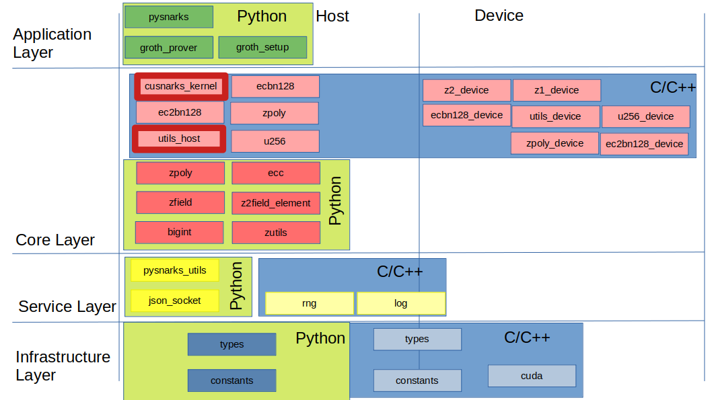

# CUSNARKS Overview
Optimized CUDA implementation of SNARK setup and prover based on [snarkjs][] implementation from *Groth16*, designed with the objective of computing proofs for up to 2^27 constraints very fast. CUsnarks is expected to work with [circom][] for the generation and compilation
of circuits, and with [snarkjs][] for the computation of parts ofr the trusted setup, witnesses and verification of the proof.

Cusnarks has been developed in C/C++/CUDA-C and Python. Python is the driving language where proof and setup scripts are launched. Computation intensive functionality on the host side has been written in C/C++. Cython is used to build wrappers around C functions so that they can be
called from Python.

Elliptic curve scalar multiplicationm multi-exponentiation and polynomial multiplication, the heaviest functionality in terms of 
computation requirements, have been implemented to run on the GPU side.

Two libraries are generated :
1. *libcusnarks.so* : Cusnarks shared library
2. *pycusnarks.so* : Cusnarks shared library wrapped with Cython wrapper so that it can be used from Python

## Outline
* [Installation][]
* [Launching Cusnarks](#Launching-Cusnarks)
* [Architecture][]
* [Modules][]
* [Installation][]
* [Using Cusnarks][]
* [Other Info](#Other-Info)
  
## Installation
1. Download repository www.github.com/iden3/cusnarks.git. From now on, the folder where cusnarks is downloaded will be called $CUSNARKS_HOME

2. Ensure that all [dependencies][] are installed. 
    - Python2.x/Python3.x
        - Cython (0.26.1)
        - numpy (1.16.4)
        - future (0.17.1)
        - nvgpu (0.8.0)
    - g++ compiler
    - nvcc compiler (Optional)
    - openmp
    - snarkjs : https://github.com/iden3/snarkjs
    - nodejs


3. Build Cusnarks to generate shared libraries in $CUSNARKS_HOME/lib.

```sh
make build
```

4. Add $CUSNARKS_HOME/lib to LD_LIBRARY_PATH

```sh
export LD_LIBRARY_PATH=$CUSNARKS_HOME/lib:$LD_LIBRARY_PATH
```

5. Generate required metadata

```sh
make config
```

6. Launch units tests (optional) -> Currently, most not working, but don't worry. Bugs are in the test :-))

```sh
make test
```

## Launching Cusnarks
Launch setup and proof generation by running pysnarks.py. 

```sh
cd src/python
python pysnarks.py -h
```

For example, to generate a trusted setup from a .json/.bin compiled circuit:

```sh
python pysnarks.py -m s -in_c <INPUT_CIRCUIT file> -pk <OUT_PROVING_KEY file> -vk <OUT_VERIFICATION_KEY file> -snarkjs <SNARKJS location>
```
Running the trusted setup, requires snarkjs being installed to compute parts of the verification key. By default, Cusnarks assumes that snarkjs is installed in $CUSNARKS_HOME/../snarkjs/. If this the case, you don't need to provide snarjks location in the command line.


To generate a proof:
```sh
python pysnarks.py -m -pk <INPUT_PROVING_KEY file> -w <INPUT_WITNESS file file> -p >OUTPUT_PROOF file> -pd <OUTPUT_PUBLIC_DATA file>
```

Furthermore, if you want to generate a proof and verify the proof using snarkjs:
```sh
python pysnarks.py -m -pk <INPUT_PROVING_KEY file> -vk <INPUT_VERIFICATION_KEY file> -w <INPUT_WITNESS file file> -p >OUTPUT_PROOF file> -pd <OUTPUT_PUBLIC_DATA file> -v 1 -snarkjs <SNARKJS location>
```

```sh
python3 pysnarks.py -m p -pk r1cs400k_pk.bin -vk r1cs400k_vk.json  -w r1cs400k_w.bin -p r1cs400k_proof.json -pd r1cs400k_pd.json -v 1 -seed 12346 -bs 16
```

## Architecture

Modules are divided into 4 categories depending on functionality:

1. **Infrastructure Layer** : Modules in this class have no dependencies and perform basic functionality common to all project (constants and type defitiontion).  Infrastructure modules can be accessed by both host and device.

2. **Service Layer** : Modules in this class Implement non core functionality used by higher layerts (logging, random number generation or CUDA kernel launch abstraction). Service modules are implemented in C or CUDA C. All services layer modules are accessible by host side. Logging can be access by both host and device.

3. **Core Layer**  ; Modules in this category implement Snarks core functionalty,  including modular and elliptic curve implementation. Core functionality is duplicated in C and Python. Python was used as a fast prototyping implementation that could be used to validate C version, and not as an efficient Snarks implementation. C counter part on the other hand was designed with the main objective of being a very efficient implementation in terms of execution time. Thus, most modules are executed in the device side. Host side C core layemodules are mainly used to define kernel function handlers.

4. **Applications Layer** : User applications. For now only prover functionality is included, but in the future witness generation and trusted setup implemention will be in this layer. Application layer modules are implemented in Python and can launch CUDA kernels via cusnarks_kernel module and host side accelerated C functions via utils_host Cython wrapped module




## Using-Cusnarks

### C

### Python


## Other Info
### Directory Structure
* *build\*    : Object files
* data\     : Auxiliary files (test circuits, precomputed roots of unity,...)
* lib\      : Generated dynamic libraries
* src\
  - cuda\     : C/C++/CUDA sources (.cpp, .c, .cu, .h)
  - cython\   : Cython files (.pyx, .pxd)
  - python\   : Python source files (.py)
* test\
  - python\   : Python unit test. They mainly test Python library using [unittest][] unit testing framework. 
   However, there are some files (*xxx_cu_xxx.py*) that test CUDA functions as well.
  - c\        : C unit tests for host side functionality.
  - ideas\    : Folder containing small scripts testing some ideas to be implmented in main code
* profiling\ : Profiling information
   python\   : Collection of scripts to measure time of CUDA functions 
* third_party_libs \ : Exteral libraries used will be automatically downloaded here
  - pcg-cpp  : implementation of PCG family of random number generators. Full details can be found at the [PCG-Random website].

### Requirements 
* python (Tested with Python 2.7)
  - numpy
* cython : Cython used to build wrappers of C++/CUDA functions callable from Python modules
* c++/gcc
* CUDA toolkit

[dependencies]: #Requirements 
[snarkjs]: https://www.github.com/iden3/snarkjs
[circom]: https://www.github.com/iden3/circom
[PCG-Random website]: http://www.pcg-random.org
[unittest]: https://python.org/3/library/unittest.html
[Architecture]: #Architecture
[Modules]: #Modules
[Installation]: #Installation
[Using Cusnarks]: #Using-Cusnarks
[Other Info]: #Other

