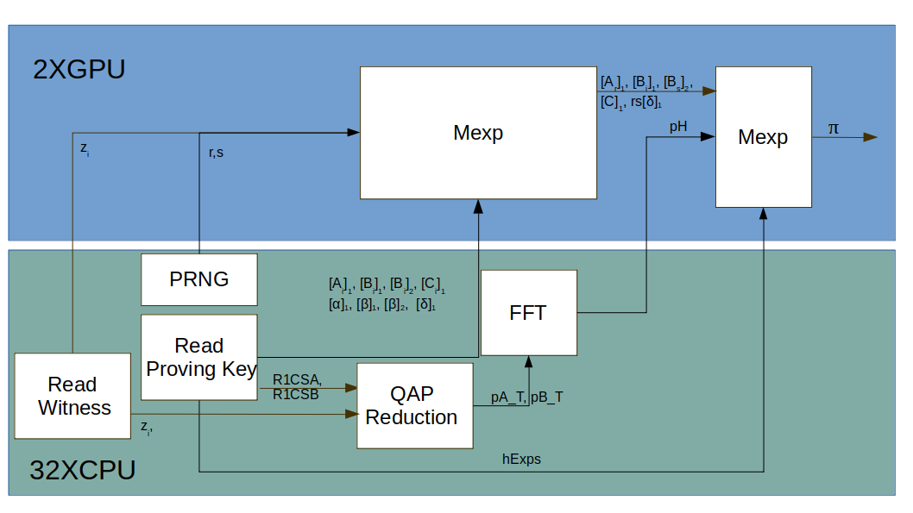
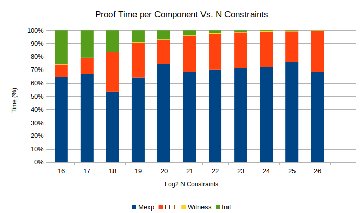
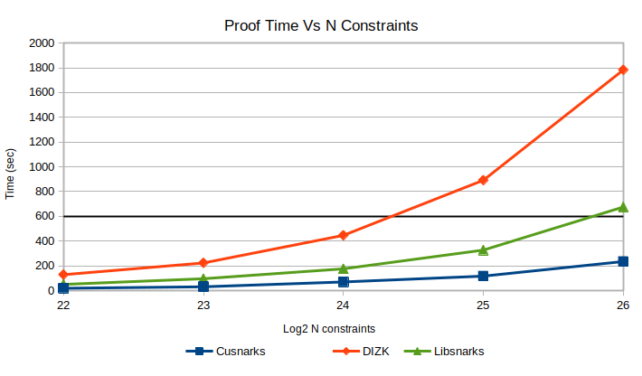
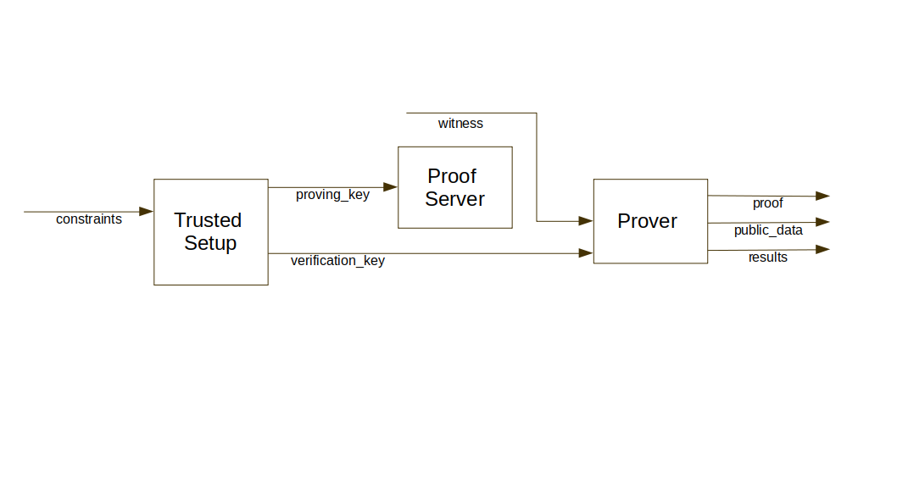

# CUSNARKS Overview
CUSNARKS is an optimized CUDA implementation of ZK-SNARK setup and prover based on *Groth16* over curve [bn128][BN128].
It has been designed with the objective of computing proofs for up to 2^27 constraints in less than 10 minutes 
(we are not quite there though). CUSNARKS is expected to work with [circom][] for the generation and 
compilation of circuits, and with [snarkjs][] for the computation witnesses, proof verification and parts of
 the trusted setup.  Additionally, CUSNARKS works with [rust-circom][], an optimized version of [circom][] that allows to compile and generate
witnesses for very large circuits.


Cusnarks has been developed in C/C++/CUDA-C and Python. Python is the driving language where proof and 
setup scripts are launched.  Computation intensive functionality on the host side has been written in C/C++.
 Computation intensive functionality on the the device (GPU) side has been writtedn in CUDA. Cython is used 
to build wrappers around C functions so that they can be called from Python. An overfiew of the software architecture
can be found [Architecture][here].

Elliptic curve scalar multiplication and polynomial multiplication (via FFT), the heaviest functionality in terms of 
computation requirements, have been implemented to run on the GPU side.

The partition of GPU vs. CPU functionality is shown in {@fig:Overview-prover_block_diagram}
{#fig:overview-prover_block_diagram}


## Outline
* [Installation][]
* [Launching Cusnarks](#Launching-Cusnarks)
* [Architecture][]
* [Modules][]
* [Some Results][]
* [File Formats][]
* [Other Info](#Other-Info)
  
## Installation
1. Download repository www.github.com/iden3/cusnarks.git. From now on, the folder where cusnarks is downloaded will be called *$CUSNARKS_HOME*

2. Ensure that all [dependencies][] are installed. 
    - Python3.6+
        - Cython (0.26.1)
        - numpy (1.16.4)
        - future (0.17.1)
        - nvgpu (0.8.0)
    - g++ compiler
    - nvcc compiler (Optional)
    - openmp
    - nodejs
    - Rust compiler

3. Add *$CUSNARKS_HOME/lib* to LD_LIBRARY_PATH

```sh
export LD_LIBRARY_PATH=$CUSNARKS_HOME/lib:$LD_LIBRARY_PATH
```

4. Build Cusnarks to generate shared libraries in *$CUSNARKS_HOME/lib*.

```sh
make all
```
Two libraries are generated upon compilation of CUSNARKs
- *libcusnarks.so* : Cusnarks shared library
- *pycusnarks.so* : Cusnarks shared library wrapped with Cython wrapper so that it can be used from Python

5. Generate some metadata required for CUSNARKS, including :
- Roots of unity for curve [bn128][BN128]. default option generates 2^20, which allows processing circuits of 
up to 2^19 contraints. When prompted, provide the desired number of roots to generate (maximum is 2^28).
- Location of folder to place input/output data. By default, location is *$CUSNARKS_HOME/circuits*

```sh
make config
```

6. Launch units tests (optional) -> Currently, not working, but don't worry. Bugs are in the test :-))

```sh
make test
```

## Launching Cusnarks
Launch setup and proof generation by running pysnarks.py. 

```sh
cd src/python
python3 pysnarks.py -h
```

To generate a trusted setup from a .json/.bin compiled circuit, type:

```sh
CUDA_DEVICE_LIST=<ordered list of GPUs> python3 pysnarks.py -m s -in_c <INPUT_CIRCUIT file> -pk <OUT_PROVING_KEY file> -vk <OUT_VERIFICATION_KEY file> -seed <RANDOM SEED> 
```

Mandatory arguments:
- INPUT_CIRCUIT file : location of file containing set of constraints generated by compiler. input file is expected to be in Extension needs to be .json, .bin or .r1cs. 
- OUT_PROVING_KEY file : Output Proving Key file generated during trusted setup. Extension needs to be .json or .bin. 
- OUT_VERIFICATION_KEY file : Output Verification Key file generated by trusted setup. Extension needs to be .json. 

A detailed description of different file formats can be found [File Formats][here].

As a general rule for providing input/output file names, if input or output files are places in the location preconfigured  during step [5] XXX TODO Add link XXX, just provide file name. CUSNARKS wil automatically search
in this directory

Running the trusted setup requires [snarkjs][] being installed to compute parts of the verification key. CUSNARKS automatically downloads it into *$CUSNARKS_HOME/third_party_libs/snarkjs*

There are two mechanisms to generate a proof:
- Server mode : Launches a server that accepts requests to generate proofs for a given trusted setup by providing a witness file. This is the default and recommended mechanism (Prover initialization is slow)
- One off : Launches a single Prover


To launch Proof Server:
```sh
CUDA_DEVICE_LIST=<ordered list of GPUs> python3 pysnarks.py -m -pk <INPUT_PROVING_KEY file> 
```

Mandatory arguments:
- INPUT_PROVING_KEY file : Input Proving Key file generated by trusted setup. Extension needs to be .json or .bin.

To request a proof: 

```sh
CUDA_DEVICE_LIST=<ordered list of GPUs> python3 pysnarks.py -m -vk <INPUT_VERIFICATION_KEY file> -w <INPUT_WITNESS file file> -p <OUTPUT_PROOF file> -pd <OUTPUT_PUBLIC_DATA file> -seed <RANDOM SEED> -v <0|1>
```
Mandatory arguments:
- INPUT_WITNESS file : Input Witness file. Extension needs to be .bin or .dat.  
- OUTPU_PROOF file :   Output file containing proof. Extension needs to be .json.  
- OUTPU_PUBLIC_DATA file : Output file containing public data. Extension needs to be .json. 

A detailed description of different file formats can be found [File Formats][here].

Optional arguments
- -v : Enable verification. If value is 1, proof verification is enabled. After proof is generated, CUSNARKS will call [snarkjs][] to verifty proof. CUSNARKS will return the output 
- INPUT_VERIFICATION_KEY file: If verification is required, location of verification file generated during trusted setup needs to be provided. Extension is .json. 

To request a proof in non server mode (assumes server is not launched. If it has been launched, it will run on Server Mode):

```sh
CUDA_DEVICE_LIST=<ordered list of GPUs> python3 pysnarks.py -m -pk<INPUT_PROVING_KEY file> -vk <INPUT_VERIFICATION_KEY file> -w <INPUT_WITNESS file file> -p <OUTPUT_PROOF file> -pd <OUTPUT_PUBLIC_DATA file> -seed <RANDOM SEED> -v <0|1>
```

## Architecture

Modules are divided into 4 categories depending on functionality:

1. **Infrastructure Layer** : Modules in this class have no dependencies and perform basic functionality common to all project (constants and type defitiontion).  Infrastructure modules can be accessed by both host and device.

2. **Service Layer** : Modules in this class Implement non core functionality used by higher layerts (logging, random number generation or CUDA kernel launch abstraction). Service modules are implemented in C or CUDA C. All services layer modules are accessible by host side. Logging can be access by both host and device.

3. **Core Layer**  ; Modules in this category implement Snarks core functionalty,  including modular and elliptic curve implementation. Core functionality is duplicated in C and Python. Python was used as a fast prototyping implementation that could be used to validate C version, and not as an efficient Snarks implementation. C counter part on the other hand was designed with the main objective of being a very efficient implementation in terms of execution time. Thus, most modules are executed in the device side. Host side C core layemodules are mainly used to define kernel function handlers.

4. **Applications Layer** : User applications. For now only prover functionality is included, but in the future witness generation and trusted setup implemention will be in this layer. Application layer modules are implemented in Python and can launch CUDA kernels via cusnarks_kernel module and host side accelerated C functions via utils_host Cython wrapped module


## Modules

## Some Results




## File Formats
CUSNARKs requires and generates different files. The picture below XXX TODO Add reference to picture XXX shows a block diagram containing the three main actors (Setup, Proof Server and Prover) and how they relate to the 
different files. In this section we will describe the different files and their formats

|File type        | Extensions|
|-----------------|-----------|
| Constraints     | .bin, .json, .rics|
|Proving Key      | .json, .bin |
|Verification Key | .json                   |
|Witness          | .txt, .json, .dat, .bin |
|Proof | .json    |
|Public Data | .json |
|Results | stdout |




### Constraints
Constraint files are generated by a SNARK compiler and consumed by CUSNARKS trusted setup.

#### .json
Constraint system generated by [circom][].  JSON file includes the following keys:
- 'constraints' : set of constraints. Every set is  3xN list thatincludes the R1CSA, R1CSB and R1CSC as coeff, value tupple.
- 'nPubInputs'  : Number of public inputs in the circuit
- 'nOutputs'    : Number of outpus in the circuit
- 'nVars'       : Number of wires
- 'cirformat'   : Representation of values in the constraint set. 0 is 256 number. 1 is Montgomery representationA
- 'protocol'    : 'groth'

#### .bin
Constraint system generated by [rust-circom][]. 32 bit words are represented as Little Endian.
- nWords[64 bits] : Length of file in 32 bit words 
- nPubInputs[64 bits] : Number of public inputs in the circuit
- nOutputs[64 bits] : Number of outputs in the circuit
- nVars[64 bits] : Number of wires in the circuit
- nConstraints[64 bits]  : Number of contraints
- cirformat[64 bits]   : Representation of values in the constraint set. 0 is 256 number. 1 is Montgomery representation
- R1CSA_nWords[64 bits] : Length of R1CSA constraints in 32 bit words
- R1CSB_nWords[64 bits] : Length of R1CSB constraints in 32 bit words
- R1CSC_nWords[64 bits] : Length of R1CSC constraints in 32 bit words
- R1CSA : R1CSA constraints
- R1CSB : R1CSB constraints
- R1CSB : R1CSC constraints

R1CS constraints are represented as follows:
- nConstraints[32 bit] : Total Number of contraints
- Number coefficients constraint_0[32 bits] 
- Cum. number coefficients constraint_1[32 bits] : N coeff constraints_0 + N coeff constraints_1 
- ...
- Cum. number coefficients constraint_N-1[32 bits] : N coeff constraints_0 + N coeff constraints_1 +...+ N constraints_N-1
- Coeff_0_0[32 bit] : constraint 0, coefficient 0
- Coeff_0_1[32 bit] : constraint 0, coefficient 1
- ...
- Coeff_0_M-1[32 bit] : constraint 0, coefficient M-1
- Value_0_0[256 bit]  : constraint 0, value 0
- Value_0_1[256 bit]  : constraint 0, value 1
- ...
- Value_0_M-1[256 bit] : constraint 0, value M-1
- Coeff_1_0[32 bit] : constraint 1, coefficient 0
- Coeff_1_1[32 bit] : constraint 1, coefficient 1
...
- Coeff_N-1_0[32 bit] : constraint N-1, coefficient 0
- Coeff_N-1_1[32 bit] : constraint N-1, coefficient 1
- ...
- Coeff_N-1_Mn-1[32 bit] : constraint N-1, coefficient Mn-1
- Value_N-1_0[256 bit]  : constraint N-1, value 0
- Value_N-1_1[256 bit]  : constraint N-1, value 1
- ...
- Value_0_Mn-1[256 bit] : constraint N-1, value Mn-1


#### .r1cs
Constraint system generated by [circom][]. See [r1cs][specification] for a detailed description.

### Proving Key
Trusted setup generated by CUSNARKS Trusted Setup and consumed by CUSNARKS Prover. 

#### .json
JSON includes the following keys:
- 'ftype' :  'PK_FILE'
- 'protocol' : 'groth'
- 'Rbitlen' : Size of Field elements. For BN128 Rbit len is '256'
- 'k_binformat' : Representation of field elements ('normal'/'montgomery')
- 'k_ecformat' : Representation of group elements ('affine')
- 'nVars':  Number of wires in circuit
- 'nPublic': Number of public data in circuit (nPubInputs + nOutputs)
- 'domainBits': Number of bits
- 'domainSize': Size (power(2,domainBits))
- 'field_r': Order of field (for BN128 field_r is "21888242871839275222246405745257275088548364400416034343698204186575808495617")
- 'group_q': Order of group (for BN128 group_1 is "21888242871839275222246405745257275088696311157297823662689037894645226208583")
- 'A' : Set of elliptic curve points A in G1.
- 'B1' : Set of elliptic curve points B1 in G1.
- 'B2' : Set of elliptic curve points B2 in G2.
- 'C' : Set of elliptic curve points C in G1
- 'hExps' : Set of elliptic curve points K[nInputs+1:nVars] in G1.
- 'polsA' : QAP A
- 'polsB' : QAP B
- 'polsC' : QAP C
- 'vk_alfa_1': Elliptic curve point alpha in G1
- 'vk_beta_1' : Elliptic curve point beta in G1
- 'vk_beta_2' : Elliptic curve point beta in G2
- 'vk_delta_1' : Elliptic curve point delta in G1
- 'vk_delta_2' : Elliptic curve point delta in G2

Note : Elliptic curve points in G1 are represented with three coordinate system (X, Y, Z=1). Elliptic curve points in G2
are represented with three coordinate system (X, Y, Z = [1,0])
#### .bin
32 bit words are represented as Little Endian in .bin format. The format of .bin files is:
- nWords[32 bit] : Unused
- ftype[32 bit] : File type (1)
- protocol[32 bit] : Protocol type (Groth -> 1)
- Rbitlen[32 bit] : Size of field/group (256)
- k_binformat[32 bit] : Representation of field elements (1 -> montgomery)
- k_ecformat[32 bit] : Representation of group elements (2 -> affine)
- nVars[32 bit]':  Number of wires in circuit
- nPublic[32 bit]: Number of public inputs in circuit
- domainBits[32 bit]: Number of bits
- domainSize[32 bit]: Size (power(2,domainBits))
- field_r[32 bit]: Field order
- group_q[32 bit]: Group order
- polsA_nWords[64 bit] : Number of 32 bit words in representation of polsA
- polsB_nWords[64 bit] : Number of 32 bit words in representation of polsB
- polsC_nWords[64 bit] : Number of 32 bit words in representation of polsC
- A_nWords[64 bit] : Number of 32 bit workds in representation of EC point A
- B1_nWords[64 bit] : Number of 32 bit workds in representation of EC point B1
- B2_nWords[64 bit] : Number of 32 bit workds in representation of EC point B2
- C_nWords[64 bit] : Number of 32 bit workds in representation of EC point C
- hExps_nWords[64 bit] : Number of 32 bit words in representation of EC point K[nInputs+1:nVars]
- polsA[n bit] : QAP A
- polsB[n bit] : QAP B
- polsC[n bit] : QAP C
- alfa_1[512 bit] : Elliptic curve point alpha in G1
- beta_1[512 bit] : Elliptic curve point beta in G1
- beta_2[1024 bit] : Elliptic curve point beta in G2
- delta_1[512 bit] : Elliptic curve point delta in G1
- delta_2[1024 bit] : Elliptic curve point delta in G2
- A[n bit] : Set of elliptic curve points A in G1
- B1[n bit] : set of elliptic curve points B1 in G1
- B2[n bit] : set of elliptic curve points B2 in G2 
- C[n bit] : set of elliptic curve points C in G1
- hExps[n bit] : set of elliptic curve points K[nInputs+1:nVars] in G1

Note : Elliptic curve points in G1 are represented with two coordinate system (X, Y). Elliptic curve points in G2 are
also represented with two coordinate system (X, Y)

Formt of polsA, polsB and polsC is:
- nVars[32 bit] : Number of embedded polys
- nCoeff_0[32 bit] : Number of coefficients in poly 0 
- nCoeff_1[32 bit] : Number of coefficients in poly 1 
- ...
- nCoeff_N-1[32 bit] : Number of coefficients in poly N-1
- Value_0_0  : Value 0, Poly 0
- Value_1_0  : Value 1, Poly 0
- ...
- Value M-1,0 : Value M-1, Poly 0
- Value 0, 1  : Value 1, Poly 1
- ...
- Value Mn-1, N-1 : Value Mn-1, Poly N-1

### Verification Key
Verification key is  generated by CUSNSAKRS during trusted setup and consumed by [snarkjs][] during proof verification.

#### .json
JSON contains the following keys:
- 'Rbitlen' : Size of field/group (for BN128 Rbitlen is "256")
- 'binFormat' : Format of field elements ('normal')
- 'domainBits' : Number of bits
- 'domainSize' : Size of FFT. (power(2,domainSize))
- 'ecFormat' : Format of Elliptic curve elements ('affine'(
- 'field_r': Order of field (for BN128 field_r is "21888242871839275222246405745257275088548364400416034343698204186575808495617")
- 'group_q': Order of group (for BN128 group_1 is "21888242871839275222246405745257275088696311157297823662689037894645226208583")
- 'nPublic': Number of public variables (Number of public input + number of output)
- 'nVars': Number of wires in the circuit
- 'protocol': 'groth'
- 'vk_alfa_1': Elliptic curve element alpha in G1
- 'vk_beta_2:  Elliptic curve element beta in G2
- 'vk_delta_2': Elliptic curve element delta in G2
- 'vk_gamma_2' : Elliptic curve element gamma in G2
- 'vk_alfabeta_12' : Pairing e(alpha, beta)
- 'IC' : Elliptic curve elements K[0:nInputs] in G1


### Witness
Witness is required for CUSNARKs prover. There are four possible formats (.txt, .json, .bin, .dat). There are two binary
represenations (.bin and .dat) because different applications generate different formats.

#### .txt
Text file including a witness in every line.

#### .json
JSON file including a comma separated witness in very line. Witness sequences is cintained between square brackets ([..])

#### .bin
Generated by [circom][]. Format is :
- nWords[32 bit] : Number of witness input
- wSize[32 bit] : Size of witness in 32 bit words
- other[32 bit] : Empty
- witness_0[n bit] : Witness 0
- witness_1[n bit] : Witness 1
- ...
- witness_N-1[n bit] : Witness N-1

#### .data
Generated by [rust-circom][]. Format is :
- nWords[32 bit] : Number of witness input
- wSize[32 bit] : Size of witness in 32 bit words
- other[64 bit] : Empty
- witness_0[n bit] : Witness 0
- witness_1[n bit] : Witness 1
- ...
- witness_N-1[n bit] : Witness N-1

### Proof
Output from CUSNARKs Prover and consumed by verifier [snarkjs][]. 

#### .json
JSON file contains the following keys:
- 'pi_a' : Elliptic curve point in G1
- 'pi_b' : Elliptic curve point in G2
- 'pi_c' : Elliptic curve point in G1
- 'protocol' : 'groth'

### Public Data
Public data 

#### .json
List containining the public elements in the input data separated by a comma.

### Results
Results are generated by the Prover. The format is  Python dictionary including the following keys:
- "Proof" : Total proof time
- "status : Result of proof verification. 0 -> Proof is incorrect. 1 -> Proof is correct, 2 -> No verification requested
- "init" : Prover initialization time list. First element in the list is the absolute time. Second element is the 
relative time with respect to the total proof time
- Read W" : Time spent reading witness file. First element in the list is the absolute time. Second element is the 
relative time with respect to the total proof time
- "Mexp" : Time spent computing multi-exponentiation in G1 and G2. First element in the list is the absolute time. Second element is the relative time with respect to the total proof time
- "Eval" : Time spent computing QAP from R1CS. First element in the list is the absolute time. Second element is the 
relative time with respect to the total proof time
- "H" : Time spent computing H. First element in the list is the absolute time. Second element is the 
relative time with respect to the total proof time

Note that the sum of all the time spent in different submodules is less than the total proof time. This is because some
things are done in parallel.


## Other Info
### Directory Structure
* *build\*    : Object files
* data\     : Auxiliary files (test circuits, precomputed roots of unity,...)
* lib\      : Generated dynamic libraries
* src\
  - cuda\     : C/C++/CUDA sources (.cpp, .c, .cu, .h)
  - cython\   : Cython files (.pyx, .pxd)
  - python\   : Python source files (.py)
* test\
  - python\   : Python unit test. They mainly test Python library using [unittest][] unit testing framework. 
   However, there are some files (*xxx_cu_xxx.py*) that test CUDA functions as well.
  - c\        : C unit tests for host side functionality.
  - ideas\    : Folder containing small scripts testing some ideas to be implmented in main code
* profiling\ : Profiling information
   python\   : Collection of scripts to measure time of CUDA functions 
* third_party_libs \ : Exteral libraries used will be automatically downloaded here
  - pcg-cpp  : implementation of PCG family of random number generators. Full details can be found at the [PCG-Random website].

### Requirements 
* python (Tested with Python 2.7)
  - numpy
* cython : Cython used to build wrappers of C++/CUDA functions callable from Python modules
* c++/gcc
* CUDA toolkit

[dependencies]: #Requirements 
[snarkjs]: https://www.github.com/iden3/snarkjs
[circom]: https://www.github.com/iden3/circom
[rust-circom]:https://www.github.com/adria0/rust-circom-experimental
[PCG-Random website]: http://www.pcg-random.org
[unittest]: https://python.org/3/library/unittest.html
[Architecture]: #Architecture
[Modules]: #Modules
[Installation]: #Installation
[Using Cusnarks]: #Using-Cusnarks
[Other Info]: #Other
[File Formats]: ##File-Formats
[r1cs]:https://hackmd.io/3epPqH4tSYqZbph2R9C5Mw 
[bn128]:https://github.com/ethereum/py_ecc/tree/master/py_ecc/bn128
[Overview]: #Overview
[Some Results]: #Some-Results


