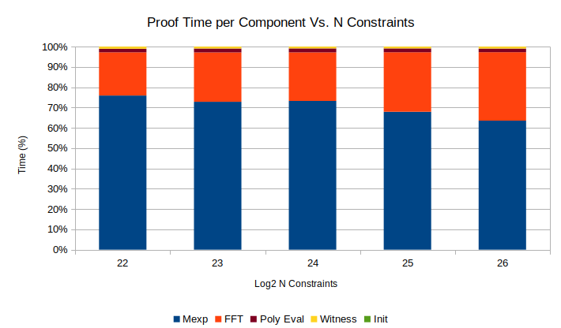
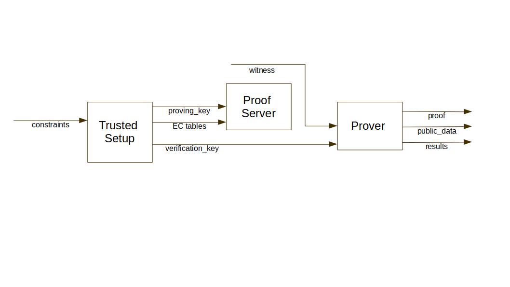

# CUSNARKS Overview
CUSNARKS is an optimized CUDA implementation of ZK-SNARK setup and prover based on *Groth16* over curve [bn128][BN128].
It has been designed with the objective of computing proofs for up to 2^27 constraints in less than 10 minutes in a platform consisting of
4xGPUs and 32xCPU cores (we are not quite there though).
CUSNARKS is expected to work with [circom][] for the generation and compilation of circuits, and with [snarkjs][] 
for the computation witnesses, proof verification and parts of
 the trusted setup.  Additionally, CUSNARKS works with [rust-circom][], an optimized version of [circom][] that allows to compile and generate
witnesses for very large circuits.


Cusnarks has been developed in C/C++/CUDA-C and Python. Python is the driving language where proof and 
setup scripts are launched.  Computation intensive functionality on the host (CPU) side has been written in C/C++.
 Computation intensive functionality on the the device (GPU) side has been writted in CUDA. Cython is used 
to build wrappers around C functions so that they can be called from Python and executed on CPU or GPU.
 An overview of the software architecture can be found [Architecture][here].

Elliptic curve scalar multiplication and polynomial multiplication (via FFT), the heaviest blocks in terms of 
computation requirements have been implemented to run on the GPU side. CPU is used during the conversion of Elliptic Curve points
from jacobian to affine cordinates and during QAP reduction in the proover. In upcomming versions we will use CPUs as an additional
resource in the FFT and multi-exponentiation stages as a way to reduce proof time.

The current partition of GPU vs. CPU functionality on the prover side is shown in below.


The trusted setup is currently very slow. Implementation has been done using a single CPU and 32-bit arithmetic, except for the multi-exponentiation stage where we use a non-optimized algorithm for a single GPU.


## Outline
* [Installation][]
* [Launching Cusnarks](#Launching-Cusnarks)
* [Architecture][]
* [Modules][]
* [Some Results][]
* [File Formats][]
* [Other Info](#Other-Info)
  
## Installation
1. Download repository www.github.com/iden3/cusnarks.git. From now on, the folder where cusnarks is downloaded will be called *$CUSNARKS_HOME*

2. Ensure that all [dependencies][] are installed. 
    - Python3.6+
        - Cython (0.26.1)
        - numpy (1.17.1)
        - future (0.17.1)
        - nvgpu (0.8.0)
    - g++ compiler (7.4.0)
    - CUDA toolkit (10.1)
    - openmp
    - node (10.16.0)
    - rust compiler

*NOTE* Current version of CUSNARKs has been tested on x86_64 Linux with Ubuntu 16.04.06 and 18.04.2 Linux distributions.

3. Add *$CUSNARKS_HOME/lib* to *LD_LIBRARY_PATH*

```sh
export LD_LIBRARY_PATH=$CUSNARKS_HOME/lib:$LD_LIBRARY_PATH
```

4. Build Cusnarks to generate shared libraries in *$CUSNARKS_HOME/lib*.

```sh
make all
```
Two libraries are generated upon compilation of CUSNARKs
- *libcusnarks.so* : Cusnarks shared library
- *pycusnarks.so* : Cusnarks shared library wrapped with Cython wrapper so that it can be used from Python

5. Generate some metadata required for CUSNARKS, including :
- Roots of unity for curve [bn128][BN128]. Default option generates 2^20, which allows processing circuits of 
up to 2^19 constraints. When prompted, provide the desired number of roots to generate (maximum is 2^28).
- Location of folder to place input/output data. By default, location is *$CUSNARKS_HOME/data*

```sh
make config
```

6. Launch units tests (optional) -> Currently, not working, but don't worry. Bugs are in the test :-))

```sh
make test
```

## Launching Cusnarks
Launch setup and proof generation by running pysnarks.py. 

```sh
cd src/python
python3 pysnarks.py -h
```

### Trusted Setup
To generate a trusted setup from a .json/.bin compiled circuit, type:

```sh
CUDA_DEVICE_LIST=<ordered list of GPUs> python3 pysnarks.py -m s -in_c <INPUT_CIRCUIT file> -pk <OUT_PROVING_KEY file> -vk <OUT_VERIFICATION_KEY file> -seed <RANDOM SEED> 
```

Mandatory arguments:
- **INPUT_CIRCUIT file** : location of file containing set of constraints generated by compiler. input file is expected to be in Extension needs to be .json, .bin or .r1cs. 
- **OUT_PROVING_KEY file** : Output Proving Key file generated during trusted setup. Extension needs to be .json or .bin. 
- **OUT_VERIFICATION_KEY file** : Output Verification Key file generated by trusted setup. Extension needs to be .json. 

A detailed description of different file formats can be found [File Formats][here].

Note : if input or output files are placed in the *$CUSNARKS_HOME/circuits* directory, just provide file name. CUSNARKS wil automatically search in this directory

Running the trusted setup requires [snarkjs][] being installed to compute parts of the verification key. CUSNARKS automatically downloads it into *$CUSNARKS_HOME/third_party_libs/snarkjs*


### Prover

There are two mechanisms to generate a proof:
- Server mode : Launches a server that accepts requests to generate proofs for a given trusted setup by providing a witness file. This is the default and recommended mechanism (Prover initialization is slow)
- One off : Launches a single Prover

#### Server Mode
To launch Proof Server:
```sh
CUDA_DEVICE_LIST=<ordered list of GPUs> python3 pysnarks.py -m p -pk <INPUT_PROVING_KEY file> 
```

Mandatory arguments:
- **INPUT_PROVING_KEY file** : Input Proving Key file generated by trusted setup. Extension needs to be .json or .bin.

To request a proof: 

```sh
CUDA_DEVICE_LIST=<ordered list of GPUs> python3 pysnarks.py -m p -vk <INPUT_VERIFICATION_KEY file> -w <INPUT_WITNESS file file> -p <OUTPUT_PROOF file> -pd <OUTPUT_PUBLIC_DATA file> -seed <RANDOM SEED> -v <0|1>
```
Mandatory arguments:
- **INPUT_WITNESS file** : Input Witness file. Extension needs to be .bin or .dat.  
- **OUTPUT_PROOF file** :   Output file containing proof. Extension needs to be .json.  
- **OUTPUT_PUBLIC_DATA file** : Output file containing public data. Extension needs to be .json. 

A detailed description of different file formats can be found [File Formats][here].

Optional arguments
- **-v** : Enable verification. If value is 1, proof verification is enabled. After proof is generated, CUSNARKS will call [snarkjs][] to verifty proof. CUSNARKS will return the output 
- **INPUT_VERIFICATION_KEY file**: If verification is required, location of verification file generated during trusted setup needs to be provided. Extension is .json. 

#### Non-Server Mode
To request a proof in non-server mode (assumes server is not launched. If it has been launched, it will run on Server Mode):

```sh
CUDA_DEVICE_LIST=<ordered list of GPUs> python3 pysnarks.py -m -pk<INPUT_PROVING_KEY file> -vk <INPUT_VERIFICATION_KEY file> -w <INPUT_WITNESS file file> -p <OUTPUT_PROOF file> -pd <OUTPUT_PUBLIC_DATA file> -seed <RANDOM SEED> -v <0|1>
```

## Architecture

Modules are divided into 4 categories depending on functionality:

1. **Infrastructure Layer** : Modules in this class have no dependencies and perform basic functionality common to all project (constants and type definition mostly). Infrastructure modules can be accessed by both host and device.

2. **Service Layer** : Modules in this class implement non core functionality used by higher layers (logging, random number generation or CUDA kernel launch abstraction). Service modules are implemented in C or CUDA C. All services layer modules are accessible by host side. Logging can be access by both host and device.

3. **Core Layer**  ; Modules in this category implement Snarks core functionalty,  including modular and elliptic curve implementation.
 Core functionality is duplicated in C and Python. Python was used as a fast prototyping implementation that could be used to validate C
 version and not as an efficient Snarks implementation. On the other hand, CUDA-C was designed with the main objective of being a very efficient
 implementation in terms of execution time. Thus, most modules are executed in the device side. Host side C core layer modules are mainly used to
 define kernel function handlers, although functionality will be extended to have CPUs accelerate computation.

4. **Applications Layer** : User applications. For now only setup and prover functionality is included, but in the future witness generation will be in in this layer.
 Application layer modules are implemented in Python and can launch CUDA kernels via cusnarks_kernel module and host side accelerated C functions via utils_host Cython
 wrapped module

Below you can see a block diagram of the software arhictecture.


## Modules

### Application

| Module Name | Executed on | Description |
|-------------|-------------|-------------|
| pysnarks | CPU | Main script that launches the setup or the proof depending on the arguments passed|
|groth_setup | CPU | Implementation of GrothSetup class |  
|groth_prover | CPU | Implementation of GrothProver class |

### Core

| Module Name | Executed on | Description |
|-------------|-------------|-------------|
| utils_host  | CPU         | Implementation of several field and elliptic curve operations. Most of them are warpped in Cython (*$CUSNARKS_HOME/src/cython/_cusnarks_kernel.pyx*) so that they can be called from Python |
| cusnarks_kernel | CPU | CUDA resource manager (memory allocation, kernel launching,...) |
| u256     | CPU | Initialization of object U256 (256 bit integer) |
|u256_device  | GPU | Implementation of u256 finite field arithmetic, including mod, addm, subm, montgomery multiplicationm... |
| zpoly    | CPU | Initialization of object Field Polynomial |
| zpoly_device   | GPU | Implementation of arithmetic on polinomials of finite field elements including FFT |
| ecbn128  | CPU | Initialization of object Elliptic Curve in G1|
| ecbn128_device  | GPU | Implementation of G1 arithmetic over BN128 curve |
| ec2bn128 | CPU | Initialization of object Elliptic curve in G2 |
| ec2bn128_device | GPU | Implementation of G2 arithmetic over BN128 curve |


Additionally, there are some additional Python modules:

| Module Name | Executed on | Description |
|-------------|-------------|-------------|
| bigint      | CPU         | Implementation of big integer functionaliy |
| zutils      | CPU         | Several utilities for field and group arithmetic |
| zfield      | CPU         | Finitie field arithmetic |
| z2field_element     | CPU    | Extended finite field arithmentic | 
|zpoly       | CPU |  Arithmetic of polynomials with finite field elements |
| ecc  | CPU |  Elliptic curve functionality |


### Service

| Module Name | Executed on | Description |
|-------------|-------------|-------------|
| pysnarks_utils | CPU      | Utilities for conversion of file formats used all around CUSNARKS |
| json_socket    | CPU      | Communication library to establish a server and a client |
| cuda_wrapper   | CPU      | Python wrapper to be able to launch CUDA kernels from Python |
| rng   | CPU  | Encapsulation of Random Number Generator pcg |
| log   | CPU/GPU  | Logging functionality. See [Logging][logging] for more details on how logging works |


### Infrastucture

| Module Name | Executed on | Description |
|-------------|-------------|-------------|
| types       | CPU/GPU     | basic type definition |
| constants   | CPU/CPU     | Constant definition |
| cuda        | GPU         | Some error check functionality for CUDA|

## Some Results
This section provides some performance results generated with Dell T640 server with 2xIntel Xeon Silver 4110@2.1GHz (32 cores), 128GB of memory and 2XGPU GTX 1080.
Maximum number of constraints achieved is 2^26 and took 1100 seconds. Proof performance for different number of constraints is shown below.


Below it is displayed the relative performance per functional block (Mexp, FFT, Witness Read and Initialization).


## File Formats
CUSNARKs requires and generates different files. The picture below shows a block diagram containing the three main actors (Setup, Proof Server and Prover) and how they relate to the 
different files. 



In this section we will describe the different files and their formats. Below you can see a table summarizing the different 
formats.

|File type        | Extensions|
|-----------------|-----------|
| Constraints     | .bin, .json, .rics|
|Proving Key      | .json, .bin |
|Verification Key | .json                   |
|Witness          | .txt, .json, .dat, .bin |
|Proof | .json    |
|Public Data | .json |
|Results | stdout |

### Constraints
Constraint files are generated by a SNARK compiler and consumed by CUSNARKS trusted setup.

#### .json
Constraint system generated by [circom][].  JSON file includes the following keys:

|Key | Description |
|----|-------------|
|constraints|set of constraints. Every set is  3xN list thatincludes the R1CSA, R1CSB and R1CSC as coeff, value tupple|
|nPubInputs|Number of public inputs in the circuit|
|nOutputs|Number of outpus in the circuit|
|nVars|Number of wires|
|cirformat| Representation of values in the constraint set. 0 is 256 number. 1 is Montgomery representation|
|protocol| 'groth'|

#### .bin
Constraint system generated by [rust-circom][]. 32 bit words are represented as Little Endian.

|Key | Bit size | Description |
|----|----------|-------------|
|nWords| 64 bits | Length of file in 32 bit words |
|nPubInputs|64 bits | Number of public inputs in the circuit |
|nOutputs|64 bits| Number of outputs in the circuit|
|nVars|64 bits|Number of wires in the circuit|
|nConstraints|64 bits| Number of constraints|
|cirformat|64 bits| Representation of values in the constraint set. 0 is 256 number. 1 is Montgomery representation|
|R1CSA_nWords|64 bits|  Length of R1CSA constraints in 32 bit words|
|R1CSB_nWords|64 bits| Length of R1CSB constraints in 32 bit words|
|R1CSC_nWords|64 bits| Length of R1CSC constraints in 32 bit words|
|R1CSA| RBCSA_nWords | R1CSA constraints|
|R1CSB| R1CSB_nWords | R1CSB constraints|
|R1CSC| R1CSC_nWords | R1CSC constraints|

R1CS constraints are represented as follows:

|Field | Bit size | Description |
|------|----------|-------------|
|nConstraints|32 bit| Total Number of constraints|
|Number coefficients constraint_0|32 bits| | 
|Cum. number coefficients constraint_1|32 bits| N coeff constraints_0 + N coeff constraints_1 1
|...| 32 bit| ... |
|Cum. number coefficients constraint_N-1|32 bits| N coeff constraints_0 + N coeff constraints_1 +...+ N constraints_N-1|
|Coeff_0_0|32 bit| constraint 0, coefficient 0|
| Coeff_0_1|32 bit| constraint 0, coefficient 1|
| ...|32 bit |... |
|Coeff_0_M-1|32 bit| constraint 0, coefficient M-1|
|Value_0_0|256 bit| constraint 0, value 0|
|Value_0_1|256 bit| constraint 0, value 1|
|...|256 bit |...|
|Value_0_M-1|256 bit|constraint 0, value M-1|
|Coeff_1_0|32 bit| constraint 1, coefficient 0|
|Coeff_1_1|32 bit| constraint 1, coefficient 1|
|...|32 bit|...|
|Coeff_N-1_0|32 bit|constraint N-1, coefficient 0|
|Coeff_N-1_1|32 bit| constraint N-1, coefficient 1|
|...|32 bit| |
|Coeff_N-1_Mn-1|32 bit|constraint N-1, coefficient Mn-1|
|Value_N-1_0|256 bit|constraint N-1, value 0|
|Value_N-1_1|256 bit|constraint N-1, value 1|
|...|256 bit|...|
|Value_0_Mn-1|256 bit|constraint N-1, value Mn-1|


#### .r1cs
Constraint system generated by [circom][]. See [r1cs][specification] for a detailed description.

### Proving Key
Trusted setup generated by CUSNARKS Trusted Setup and consumed by CUSNARKS Prover. 

#### .json
JSON includes the following keys:

|Key | Description |
|----|-------------|
|ftype|'PK_FILE'|
|protocol|'groth'|
|Rbitlen|Size of Field elements. For BN128 Rbit len is '256'|
|k_binformat|Representation of field elements ('normal'/'montgomery')|
|k_ecformat| Representation of group elements ('affine') |
|nVars|  Number of wires in circuit|
|nPublic| Number of public data in circuit (nPubInputs + nOutputs)|
|domainBits|: Number of bits|
|domainSize| Size (power(2,domainBits))|
|field_r| Order of field (for BN128 field_r is "21888242871839275222246405745257275088548364400416034343698204186575808495617")|
|group_q| Order of group (for BN128 group_1 is "21888242871839275222246405745257275088696311157297823662689037894645226208583")|
|A|Set of elliptic curve points A in G1|
|B1| Set of elliptic curve points B1 in G1|
|B2| Set of elliptic curve points B2 in G2|
|C| Set of elliptic curve points C in G1|
|hExps| Set of elliptic curve points K[nInputs+1:nVars] in G1|
|polsA| QAP A |
|polsB| QAP B |
|polsC| QAP C |
|vk_alfa_1|Elliptic curve point alpha in G1|
|vk_beta_1| Elliptic curve point beta in G1|
|vk_beta_2| Elliptic curve point beta in G2|
|vk_delta_1| Elliptic curve point delta in G1|
|vk_delta_2| Elliptic curve point delta in G2|

Note : Elliptic curve points in G1 are represented with three coordinate system (X, Y, Z=1). Elliptic curve points in G2
are represented with three coordinate system (X, Y, Z = [1,0])

#### .bin
32 bit words are represented as Little Endian in .bin format. The format of .bin files is:

|Field | Bit size | Description |
|------|----------|-------------|
|nWords|32 bit| Unused |
|ftype|32 bit| File type (1) |
|protocol|32 bit| Protocol type (Groth -> 1)|
|Rbitlen|32 bit| Size of field/group (256)|
|k_binformat|32 bit| Representation of field elements (1 -> montgomery)|
|k_ecformat|32 bit| Representation of group elements (2 -> affine)|
|nVars|32 bit| Number of wires in circuit|
|nPublic|32 bit| Number of public inputs in circuit|
|domainBits|32 bit| Number of bits |
|domainSize|32 bit| Size (power(2,domainBits))|
|field_r|32 bit| Field order |
|group_q|32 bit| Group order |
|polsA_nWords|64 bit| Number of 32 bit words in representation of polsA|
|polsB_nWords|64 bit| Number of 32 bit words in representation of polsB|
|polsC_nWords|64 bit| Number of 32 bit words in representation of polsC|
|A_nWords|64 bit| Number of 32 bit workds in representation of EC point A|
|B1_nWords|64 bit| Number of 32 bit workds in representation of EC point B1|
|B2_nWords|64 bit| Number of 32 bit workds in representation of EC point B2|
|C_nWords|64 bit| Number of 32 bit workds in representation of EC point C|
|hExps_nWords|64 bit| Number of 32 bit words in representation of EC point K[nInputs+1:nVars]|
|polsA|n bit|: QAP A|
|polsB|n bit|: QAP B|
|polsC|n bit|: QAP C|
|alfa_1|512 bit| Elliptic curve point alpha in G1|
|beta_1|512 bit| Elliptic curve point beta in G1|
|beta_2|1024 bit| Elliptic curve point beta in G2|
|delta_1|512 bit| Elliptic curve point delta in G1|
|delta_2|1024 bit| Elliptic curve point delta in G2|
|A|n bit| Set of elliptic curve points A in G1|
|B1|n bit| set of elliptic curve points B1 in G1|
|B2|n bit| set of elliptic curve points B2 in G2 |
|C|n bit| set of elliptic curve points C in G1|
|hExps|n bit| set of elliptic curve points K[nInputs+1:nVars] in G1|

Note : Elliptic curve points in G1 are represented with two coordinate system (X, Y). Elliptic curve points in G2 are
also represented with two coordinate system (X, Y)

Formt of polsA, polsB and polsC is:

|Field | Bit size | Description |
|------|----------|-------------|
| nVars|32 bit| Number of embedded polys|
| nCoeff_0|32 bit| Number of coefficients in poly 0 |
| nCoeff_1|32 bit| Number of coefficients in poly 1| 
| ... |32 bit|...|
| nCoeff_N-1|32 bit|Number of coefficients in poly N-1|
| Value_0_0 |256 bit| Value 0, Poly 0|
| Value_1_0|256 bit|  Value 1, Poly 0|
| ...| 256 bit|...|
| Value M-1,0| 256 bit| Value M-1, Poly 0|
| Value 0, 1|256 bit| Value 1, Poly 1|
| ... | 256 bit|...|
| Value Mn-1, N-1|256 bit| Value Mn-1, Poly N-1|

### Verification Key
Verification key is  generated by CUSNSAKRS during trusted setup and consumed by [snarkjs][] during proof verification.

#### .json
JSON contains the following keys:

|Key | Description |
|----|-------------|
|Rbitlen| Size of field/group (for BN128 Rbitlen is "256")|
|binFormat| Format of field elements ('normal')|
|domainBits| Number of bits|
|domainSize| Size of FFT. (power(2,domainSize))|
|ecFormat| Format of Elliptic curve elements ('affine')|
|field_r|Order of field (for BN128 field_r is "21888242871839275222246405745257275088548364400416034343698204186575808495617")|
|group_q|Order of group (for BN128 group_1 is "21888242871839275222246405745257275088696311157297823662689037894645226208583")|
|nPublic|Number of public variables (Number of public input + number of output)|
|nVars|Number of wires in the circuit|
|protocol|'groth'|
|vk_alfa_1|Elliptic curve element alpha in G1|
|vk_beta_2|Elliptic curve element beta in G2|
|vk_delta_2|Elliptic curve element delta in G2|
|vk_gamma_2| Elliptic curve element gamma in G2|
|vk_alfabeta_12| Pairing e(alpha, beta)|
|IC| Elliptic curve elements K[0:nInputs] in G1|


### Witness
Witness is required for CUSNARKs prover. There are four possible formats (.txt, .json, .bin, .dat). There are two binary
represenations (.bin and .dat) because different applications generate different formats.

#### .txt
Text file including a witness in every line.

#### .json
JSON file including a comma separated witness in very line. Witness sequences is cintained between square brackets ([..])

#### .bin
Generated by [circom][]. Format is :

|Field | Bit size | Description |
|------|----------|-------------|
|nWords|32 bit|  Number of witness input |
|wSize|32 bit|  Size of witness in 32 bit words |
|other|32 bit|  Empty |
|witness_0|n bit| Witness 0 |
|witness_1|n bit| Witness 1 |
|...|n bit| ...|
|witness_N-1|n bit| Witness N-1|

#### .data
Generated by [rust-circom][]. Format is :
- nWords[32 bit] : Number of witness input
- wSize[32 bit] : Size of witness in 32 bit words
- other[64 bit] : Empty
- witness_0[n bit] : Witness 0
- witness_1[n bit] : Witness 1
- ...
- witness_N-1[n bit] : Witness N-1

### Proof
Output from CUSNARKs Prover and consumed by verifier [snarkjs][]. 

#### .json
JSON file contains the following keys:

|Key | Description |
|----|-------------|
|pi_a|  Elliptic curve point in G1|
|pi_b|  Elliptic curve point in G2|
|pi_c|  Elliptic curve point in G1|
|protocol| groth|

### Public Data
Public data 

#### .json
List containining the public elements in the input data separated by a comma.

### Results
Results are generated by the Prover. The format is  Python dictionary including the following keys:

|Key | Description |
|----|-------------|
|Proof| Total proof time |
|status | Result of proof verification. 0 -> Proof is incorrect. 1 -> Proof is correct, 2 -> No verification requested |
|init| Prover initialization time list. First element in the list is the absolute time. Second element is the relative time with respect to the total proof time|
|read W| Time spent reading witness file. First element in the list is the absolute time. Second element is the relative time with respect to the total proof time|
|Mexp| Time spent computing multi-exponentiation in G1 and G2. First element in the list is the absolute time. Second element is the relative time with respect to the total |Eval| Time spent computing QAP from R1CS. First element in the list is the absolute time. Second element is the relative time with respect to the total proof time|
|H|Time spent computing H. First element in the list is the absolute time. Second element is the relative time with respect to the total proof time|

Note that the sum of all the time spent in different submodules is less than the total proof time. This is because some
things are done in parallel.


## Other Info
### Directory Structure
* **build**\    : Object files
* **data**\     : Auxiliary files (precomputed roots of unity,...)
* **lib**\      : Generated dynamic libraries
* **src**\
  - *cuda*\     : C/C++/CUDA sources (.cpp, .c, .cu, .h)
  - *cython*\   : Cython files (.pyx, .pxd)
  - *python*\   : Python source files (.py)
* **test**\
  - *python*\   : Python unit test. They mainly test Python library using [unittest][] unit testing framework. 
   However, there are some files (*xxx_cu_xxx.py*) that test CUDA functions as well.
  - *c*\        : C unit tests for host side functionality.
  - *ideas*\    : Folder containing small scripts testing some ideas to be implmented in main code
* **profiling**\ : Profiling information
   - *python*\   : Collection of scripts to measure time of CUDA functions 
* **third_party_libs**\ : Exteral libraries used will be automatically downloaded here
   - *pcg-cpp*\  : implementation of PCG family of random number generators. Full details can be found at the [PCG-Random website].
   - *snarkjs*\  : snarkjs repository
   - *rust-circom*\ : rust circom repository
* **circuits**\   : Default location where circuits are processed by CUSNARKS.
   - *_SETUP*\    : Default location where Trusted setup files are copied.
   - *_PROOF*\    : Default location where Proof fils are copied.
* **config**\     : Location of initial configuration scripts.

### Logging
There are two types of logging.
From Python side, logs during trusted setup are recorded in *$CUSNARKS_HOME/circuits/_SETUP/log*, and during proof in 
*$CUSNARKS_HOME/circuits/_PROOF/log*

From C/CUDA side, logs are available as well, but are disabled by default. To enable logs, edit *$CUSNARKS_HOME/src/cuda/log.h* file.
There are two constants defined :
- *LOG_LEVEL* : There are 5 levels of logging (nolog, error, warning, info, debug). To enable logs, define *LOG_LEVEL* constant as 
one of these types. Use function LogError(), LogWarning(), LogInfo(), LogDebug() to log a message. Message is displyed in standard 
output. These functions are only to be used in CPU side.
- *LOG_TID* : Define the kernel thread id that you want to display the message. To log a message for a particular TID, use 
functions LogXXXBigNumberTid or LogX XXTid, where XXX is Error, Warning, Info or Debug depending on the severity. 
LogXXXBigNumberTid displays a U256 integer. LogXXXTid can be used to display other types. Its use is similar to printf.

After modifying *log.h* you will need to do a *make clean build* to recompile with the new changes.

[dependencies]: #Requirements 
[snarkjs]: https://www.github.com/iden3/snarkjs
[circom]: https://www.github.com/iden3/circom
[rust-circom]:https://www.github.com/adria0/rust-circom-experimental
[PCG-Random website]: http://www.pcg-random.org
[unittest]: https://python.org/3/library/unittest.html
[Architecture]: #Architecture
[Modules]: #Modules
[Installation]: #Installation
[Using Cusnarks]: #Using-Cusnarks
[Other Info]: #Other
[File Formats]: ##File-Formats
[r1cs]:https://hackmd.io/3epPqH4tSYqZbph2R9C5Mw 
[bn128]:https://github.com/ethereum/py_ecc/tree/master/py_ecc/bn128
[Overview]: #Overview
[Some Results]: #Some-Results
[Logging]: ###Logging

